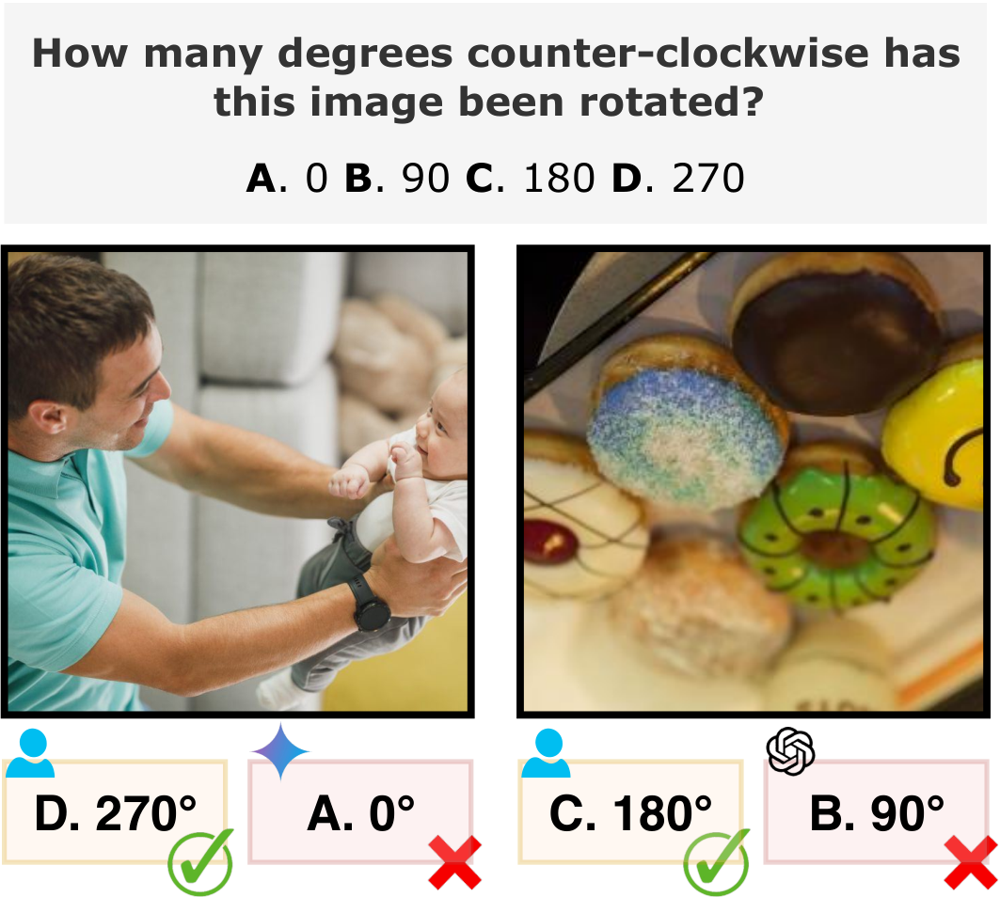

# RotBench


Authors: [Tianyi Niu](https://www.linkedin.com/in/tianyi-niu/)¹, [Jaemin Cho](https://j-min.io/)¹, [Elias Stengel-Eskin](https://esteng.github.io)¹, and [Mohit Bansal](https://www.cs.unc.edu/~mbansal/)¹

¹UNC Chapel Hill <br>

***RotBench data will be released soon***

# Abstract



---
We investigate to what extent Multimodal Large Language Models (MLLMs) can accurately identify the orientation of input images rotated 0°, 90°, 180°, and 270°. This task demands robust visual reasoning capabilities to detect rotational cues and contextualize spatial relationships within images, regardless of their orientation. To evaluate MLLMs on these abilities, we introduce RotBench -- a 350-image manually-filtered benchmark comprising lifestyle, portrait, and landscape images. Despite the relatively simple nature of this task, we show that several state-of-the-art open and proprietary MLLMs, including GPT-5, o3, and Gemini-2.5-Pro, do not reliably identify rotation in input images. Providing models with auxiliary information -- including captions, depth maps, and more -- or using chain-of-thought prompting offers only small and inconsistent improvements. Our results indicate that most models are able to reliably identify right-side-up (0°) images, while certain models are able to identify upside-down (180°) images. None can reliably distinguish between 90° and 270°. Simultaneously showing the image rotated in different orientations leads to moderate performance gains for reasoning models, while a modified setup using voting improves the performance of weaker models. We further show that fine-tuning does not improve models' ability to distinguish 90° and 270° rotations, despite substantially improving the identification of 180° images. Together, these results reveal a significant gap between MLLMs' spatial reasoning capabilities and human perception in identifying rotation.

# RotBench Pipeline


---

For each image in RotBench, we rotate the image 0°, 90°, 180°, and 270° counter-clockwise. We represent the rotation estimation problem as a multiple-choice question answering problem, and separately measure accuracy on each image orientation. We optionally provide different forms of auxiliary information to aid the model in identifying image rotation. We emphasize that all forms of auxiliary information are separately extracted for each rotation; the ground truth rotation is not marked.

# Setup

## VLLM Servers

We evaluate Llama-3.2-11B-Vision (meta-llama/Llama-3.2-11B-Vision) and Qwen2.5-VL-7B-Instruct (Qwen/Qwen2.5-VL-7B-Instruct) on RotBench. We also use Qwen--8B (Qwen/Qwen3-8B) to evalute all model responses. Our code assumes access to these models through the following ports on localhost: 

| Model         | Port  |
|---------------|-------|
| Qwen 3        | 7471  |
| Qwen 2.5 VL   | 7472  |
| Llama 3.2     | 7473  |

## Model Nicknames

The codebase makes frequent use of the follwoing model nicknames:

| Nickname      | Model Name                                       |
|---------------|--------------------------------------------------|
| Llama11       | meta-llama/Llama-3.2-11B-Vision-Instruct         |
| Qwen7         | Qwen/Qwen2.5-VL-7B-Instruct                      |
| Qwen32        | Qwen/Qwen2.5-VL-32B-Instruct                     |
| GPT4o         | gpt-4o                                           |
| GPT41         | gpt-4.1                                          |
| GPT5          | gpt-5                                            |
| o3            | o3                                               |
| Gemini2       | gemini-2.0-flash                                 |
| Gemini25      | gemini-2.5-flash                                 |
| Gemini25pro   | gemini-2.5-pro                                   |

## API Keys

To run call proprietary models, ensure you replace the placeholder API keys in `.env`

## Data Download 

All images in RotBench are available on ***[HuggingFace](https://huggingface.co/datasets/tianyin/RotBench)***

```python
from datasets import load_dataset

dataset = load_dataset("tianyin/RotBench")
data = dataset['large'] # or dataset['small']

for i, sample in enumerate(data):
    image = sample['image']  # PIL Image object
    image_name = sample['image_name'] 
```

The following scripts expect a directory named `RotBench-Data` and placed at the top-level of the repository. `RotBench-Data` contains to child directories: `RotBench_large` and `RotBench_small`. `download_and_format_data.py` will download and format the dataset for you.

## Obtaining Rotated Datasets

After downloading the dataset, execute:

`python create_datasets.py`

The script will create four separate datasets for both `RotBench_large` and `RotBench_small`, each containing the images rotated 0, 90, 180, and 270 degrees counter-clockwise. The resulting dataests are saved in `./Small` and `./Large`.

The directory should follow this structure:

<pre>
RotBench
├── Get_Additional_Info
│   ├── get_bounding_boxes.py
│   ├── get_captions.py
│   ├── get_depth_maps.py
│   ├── get_image_subjects.py
│   ├── get_rotated_grid.py
│   ├── get_scene_graph.py
│   └── get_seg_mask.py
├── RotBench-Data
│   ├── RotBench_large
│   └── RotBench_small
├── large
│   ├── 0_imgs
│   ├── 90_imgs
│   ├── 180_imgs
│   └── 270_imgs
├── small
│   ├── 0_imgs
│   ├── 90_imgs
│   ├── 180_imgs
│   └── 270_imgs
├── README.md
├── .env
├── common.py
├── create_datasets.py
├── evaluate.py
├── inference.py
└── README.md
</pre>

## Creating Auxiliary Information

`./Get_Additional_Info` includes all scripts necessary for extracting the various forms of auxiliary information. Ensure `get_image_subject.py` is first executed as multiple files require a list of image subjects as a prerequisite. 

Extract image subjects: 
`python Get_Additional_Info/get_image_subjects.py -ds small`.

# Main Results

## Quickstart

Download RotBench and execute `quickstart.sh` to evaluate GPT-4o on RotBench-Small without any forms of auxiliary information.

`> ./quickstart.sh`

Alternatively, follow the steps below to obtain and evaluate results separately.

## Obtain and Evaluate Model Predictions on RotBench

```python
# Get predictions and evaluate GPT-4o on RotBench-large with a seed of 0 and no auxiliary information:
python inference.py -nick GPT4o -ds large --run 0
python evaluate.py -nick GPT4o -ds large --runs 0 

# Get predictions and evaluate GPT-5 on RotBench-small with a seed of 0 and depth maps:
python inference.py -nick GPT4o -ds small --run 0 -dm
python evaluate.py -nick GPT4o -ds small --runs 0 -dm
```

### Expected Results 

The authors obtained the following results evaluating various models on RotBench_Large and RotBench_Small using different forms of auxiliary information. All results are obtained from three runs. Accuracy is scored on a four-way classification task.

<details>
<summary>RotBench-Large Results</summary>

| Model | 0° | 90° | 180° | 270° |
|-------|----|----|-----|-----|
| **Owen-2.5-VL-7B-Instruct** | | | | |
| Zero-shot | 0.99±0.00 | 0.51±0.01 | 0.05±0.01 | 0.09±0.01 |
| + Caption | **1.00±0.00** | 0.51±0.01 | 0.23±0.01 | 0.07±0.00 |
| + Bounding Box | 0.90±0.00 | 0.48±0.01 | 0.01±0.00 | 0.11±0.00 |
| + Scene Graph | 0.97±0.01 | 0.51±0.01 | 0.01±0.01 | 0.11±0.02 |
| + Depth Map | 0.93±0.01 | 0.55±0.02 | 0.04±0.01 | 0.13±0.02 |
| + Segmentation Map | 0.81±0.01 | **0.63±0.02** | 0.03±0.02 | 0.16±0.01 |
| + Chain-of-thought | 0.88±0.01 | 0.26±0.02 | **0.34±0.01** | 0.23±0.02 |
| + Rotation Grid | 0.57±0.04 | 0.15±0.02 | 0.13±0.01 | 0.28±0.00 |
| + Rotation Grid Guided | 0.59±0.01 | 0.12±0.01 | 0.13±0.00 | 0.30±0.02 |
| + all above | 0.47±0.03 | 0.26±0.01 | 0.17±0.01 | **0.33±0.02** |
| | | | | |
| **Gemini-2.0-Flash** | | | | |
| Zero-shot | **1.00±0.00** | 0.30±0.00 | 0.72±0.00 | 0.44±0.01 |
| + Caption | **1.00±0.00** | 0.38±0.00 | **0.76±0.00** | 0.44±0.01 |
| + Bounding Box | **1.00±0.00** | 0.43±0.03 | 0.71±0.00 | 0.34±0.02 |
| + Scene Graph | **1.00±0.00** | 0.41±0.00 | 0.71±0.00 | 0.33±0.02 |
| + Depth Map | **1.00±0.00** | 0.30±0.01 | 0.69±0.01 | **0.46±0.01** |
| + Segmentation Map | **1.00±0.00** | 0.28±0.00 | 0.73±0.02 | 0.45±0.00 |
| + Chain-of-thought | **1.00±0.00** | **0.63±0.00** | **0.76±0.01** | 0.19±0.1 |
| + Rotation Grid | **1.00±0.00** | 0.07±0.01 | 0.57±0.01 | 0.07±0.01 |
| + Rotation Grid Guided | **1.00±0.00** | 0.10±0.00 | 0.61±0.00 | 0.25±0.01 |
| + all above | **1.00±0.00** | 0.1±0.01 | 0.67±0.01 | 0.17±0.01 |
| | | | | |
| **GPT-4o** | | | | |
| Zero-shot | 0.99±0.00 | 0.69±0.02 | **0.93±0.00** | 0.19±0.01 |
| + Caption | 0.98±0.00 | 0.65±0.00 | **0.93±0.01** | 0.23±0.02 |
| + Bounding Box | 0.98±0.01 | 0.59±0.01 | 0.91±0.00 | 0.31±0.04 |
| + Scene Graph | 0.98±0.00 | 0.55±0.00 | **0.93±0.00** | 0.33±0.02 |
| + Depth Map | **1.00±0.00** | 0.55±0.03 | **0.93±0.00** | 0.26±0.01 |
| + Segmentation Map | 0.87±0.00 | 0.67±0.01 | **0.95±0.00** | 0.21±0.00 |
| + Chain-of-thought | 0.97±0.01 | 0.57±0.03 | **0.93±0.00** | 0.32±0.00 |
| + Rotation Grid | 0.98±0.00 | **0.71±0.02** | **0.93±0.00** | 0.19±0.03 |
| + Rotation Grid Guided | 0.98±0.00 | 0.46±0.03 | **0.93±0.00** | **0.41±0.00** |
| + all above | **1.00±0.00** | 0.46±0.03 | 0.91±0.00 | 0.36±0.02 |
</details>

<details>
<summary>RotBench-Small Results</summary>

| Model | 0° | 90° | 180° | 270° |
|-------|----|----|-----|-----|
| **Human** | | | | |
| Zero-shot | 0.99 | 0.99 | 0.99 | 0.97 |
| | | | | |
| **Owen-2.5-VL-7B-Instruct** | | | | |
| Zero-shot | 0.95±0.01 | **0.57±0.04** | 0.03±0.02 | 0.15±0.05 |
| + Chain-of-thought | 0.86±0.00 | 0.20±0.04 | **0.13±0.03** | **0.30±0.04** |
| | | | | |
| **GPT-4o** | | | | |
| Zero-shot | 0.87±0.02 | **0.65±0.04** | 0.85±0.01 | 0.21±0.03 |
| + Chain-of-thought | **0.91±0.01** | 0.59±0.01 | **0.86±0.00** | 0.21±0.05 |
| | | | | |
| **GPT-4.1** | | | | |
| Zero-shot | 0.95±0.01 | 0.63±0.07 | **0.85±0.03** | **0.19±0.09** |
| + Chain-of-thought | **0.98±0.00** | **0.88±0.00** | **0.85±0.01** | 0.03±0.03 |
| | | | | |
| **GPT-5** | | | | |
| Zero-shot | **1.00±0.00** | 0.41±0.03 | **0.81±0.01** | **0.59±0.04** |
| + Chain-of-thought | **1.00±0.00** | **0.53±0.05** | **0.81±0.02** | 0.57±0.07 |
| | | | | |
| **Gemini-2.0-Flash** | | | | |
| Zero-shot | **1.00±0.00** | 0.25±0.04 | 0.48±0.01 | **0.43±0.07** |
| + Chain-of-thought | **1.00±0.00** | **0.61±0.01** | **0.59±0.01** | 0.25±0.01 |
| | | | | |
| **Gemini-2.5-Flash** | | | | |
| Zero-shot | **1.00±0.00** | 0.23±0.06 | **0.50±0.03** | **0.47±0.02** |
| + Chain-of-thought | **1.00±0.00** | 0.23±0.01 | 0.44±0.02 | 0.40±0.02 |
| | | | | |
| **o3** | | | | |
| Zero-shot | **1.00±0.00** | 0.45±0.04 | 0.70±0.03 | 0.48±0.03 |
| + Chain-of-thought | **1.00±0.00** | 0.36±0.00 | **0.74±0.04** | 0.57±0.01 |
| + Rotation Grid | 0.99±0.01 | 0.23±0.05 | **0.83±0.05** | **0.81±0.01** |
| + Rotation Grid Guided | 0.99±0.01 | 0.31±0.01 | 0.82±0.02 | 0.75±0.01 |
| | | | | |
| **Gemini-2.5-Pro** | | | | |
| Zero-shot | **1.00±0.00** | **0.50±0.04** | 0.72±0.00 | 0.40±0.06 |
| + Chain-of-thought | **1.00±0.00** | 0.46±0.02 | 0.71±0.01 | 0.49±0.01 |
| + Rotation Grid | 0.99±0.01 | 0.58±0.00 | 0.67±0.03 | 0.59±0.03 |
| + Rotation Grid Guided | 0.95±0.01 | **0.71±0.01** | **0.73±0.03** | **0.74±0.04** |

</details>

---

# Additional Experiments

The following scripts obtain results from the binary clockwise & counter-clockwise experiment, in-context learning experiment, and the normalized majority voting experiment.

```python 
# Binary Clockwise vs. Counter-clockwise Classification with GPT-4o
python CW_CCW_inference.py -n GPT4o
python CW_CCW_evaluate.py -n GPT4o

# In-context Learning
# Example evaluates Qwen with 10 in-context examples 
python ICL.py -n 10

# Normalized Voting 
# Note running this file first requires obtaining zero-shot data for the model of choice. In other words, first run `inference.py` with no auxiliary information. 
# To evaluate model using Normalized Rotation Voting: 
python NormalizedVoting.py -nick Qwen7
```

## Fine-tuning Qwen

### Downloading and Processing MS COCO

First download the 2017 Val split of [MS COCO](https://cocodataset.org/#download), and save directory as `./MS_COCO`.

Next, execute `create_ms_coco_rotated.py` to rotate the dataset. 

The resulting directory should look like this: 
<pre>
RotBench
├── Coco
│   ├── 0_imgs
│   ├── 90_imgs
│   ├── 180_imgs
│   └── 270_imgs
</pre>

### Fine-tune the model

```python 
# Train the model with seed 0, saved into ./QwenFT
python FT_training.py -r 0 -fp QwenFT

# Evaluate the saved model with seed 0
python FT_inference.py -r 0 -fp QwenFT
```

## Citation

If you find our project useful in your research, please cite the following paper:

```bibtex
@misc{niu2025rotbenchevaluatingmultimodallarge,
      title={RotBench: Evaluating Multimodal Large Language Models on Identifying Image Rotation}, 
      author={Tianyi Niu and Jaemin Cho and Elias Stengel-Eskin and Mohit Bansal},
      year={2025},
      eprint={2508.13968},
      archivePrefix={arXiv},
      primaryClass={cs.CV},
      url={https://arxiv.org/abs/2508.13968}, 
}
```
